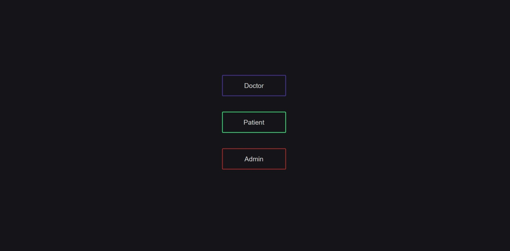
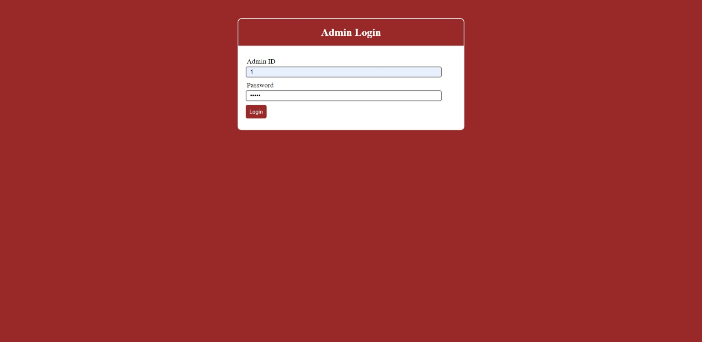
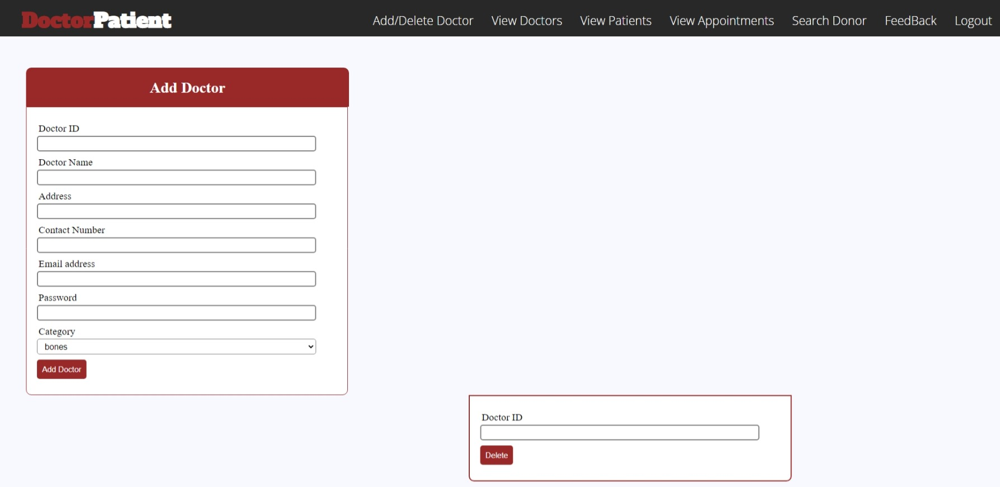
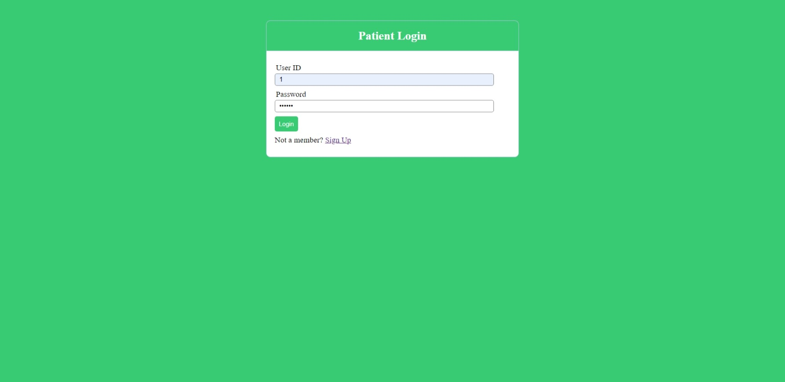
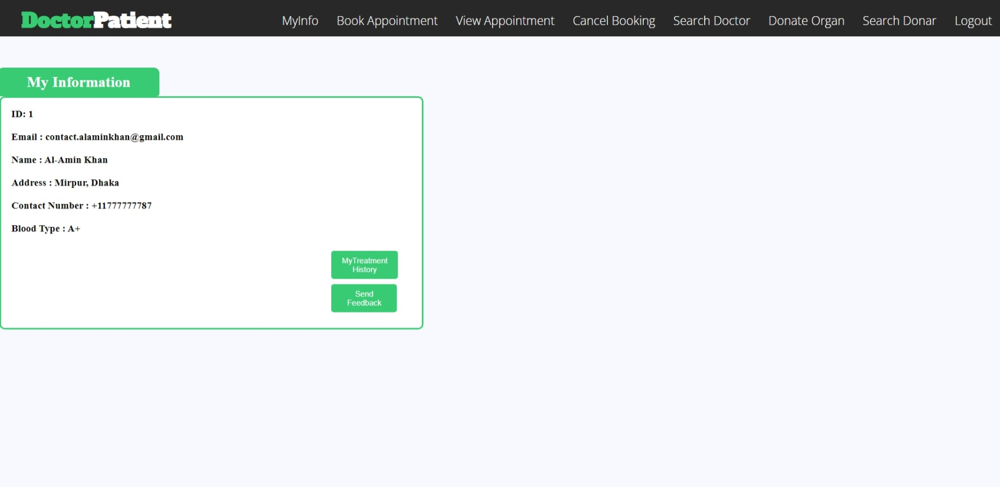
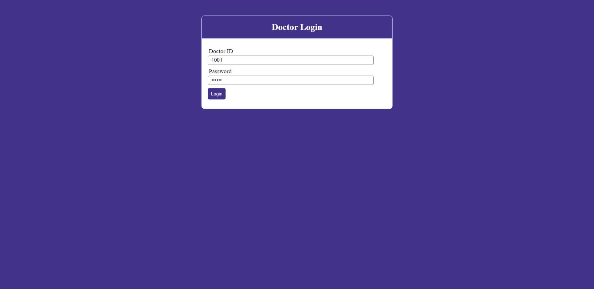
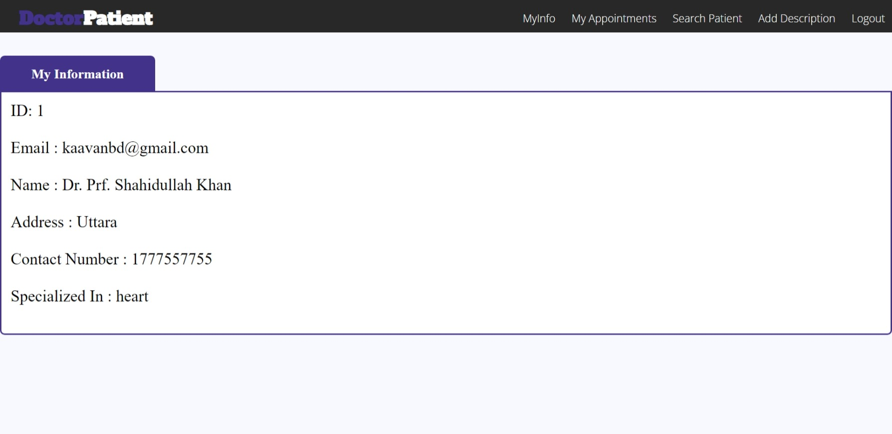

# BRTC Ticket Booking System

### For Live demo: **[click here](https://php-dr-appointment.herokuapp.com/)**
> **Admin Login:**  User ID: 1 | Password: admin

The Docter Appointment In PHP is a simple project developed using PHP, JavaScript, and CSS. The project contains an admin and user sides. The admin side manages all the management like adding and deleting doctors’ records, viewing patient records, and appointments.

  

## TECH/FRAMEWORK USED:

* HTML

* CSS

* Javascript

* PHP

* Xampp Server

* MySQL

## This are some Outputs of the Project:

  

### Home page

### Admin login page

### Admin dashboard

### User login page

### User dashboard

### Doctor login page

### Doctor dashboard

